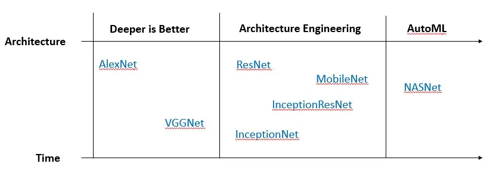

# Task 6: Image Classification 
## References: 
The following images come from these links:
- [From AlexNet to NASNet](https://towardsdatascience.com/from-alexnet-to-nasnet-a-brief-history-and-introduction-of-convolutional-neural-networks-cf63bf3320e1)
- [Difference between AlexNet, VGGNet, ResNet, and Inception](https://towardsdatascience.com/the-w3h-of-alexnet-vggnet-resnet-and-inception-7baaaecccc96)
- [VGG-16](https://www.geeksforgeeks.org/vgg-16-cnn-model/)

 

## InceptionV3
My InceptionV3 model for task 6: [InceptionV3](inceptionv3_model.ipynb)
- Focuses on effective kernel sizes, think wider not deeper with layers
  - Multiple kernels of different sizes implemented in the same layer
  - Several [inception modules](https://miro.medium.com/v2/resize:fit:1400/format:webp/1*4ZYNeTDs3ss_fq_MKSq7zQ.png) 

## Resnet101V2
My Resnet101V2 model for task 6: [Resnet101V2 Model](resnet101_model.ipynb)
- Resnet has multiple variants (Resnet50, Resnet101, etc.) that denotes the # of layers
- Resnet introduces shortcut connections in its architecture:
  - [Residual Block](https://miro.medium.com/v2/resize:fit:1140/format:webp/1*6WlIo8W1_Qc01hjWdZy-1Q.png) repeated 
    throughout the network

## VGG16
My VGG16 model for task 6: [VGG16 Model](vgg16_model.ipynb)
- VGGNet has multiple variants (VGG16, VGG19, etc.) which differ only in the # of layers in the model
- VGGNet was created to reduce the # of parameters in the CONV layers
- **All the conv kernels are of size 3x3 and max pool kernels are of size 2x2 with a stride of two.**
- With less trainable variables, learning is faster with less chances of overfitting
- [VGG-16 architecture](https://media.geeksforgeeks.org/wp-content/uploads/20200219152207/new41.jpg)